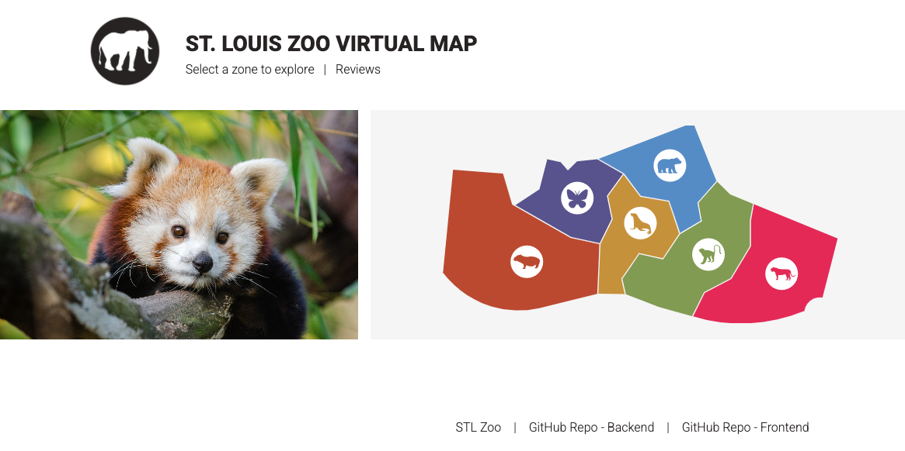
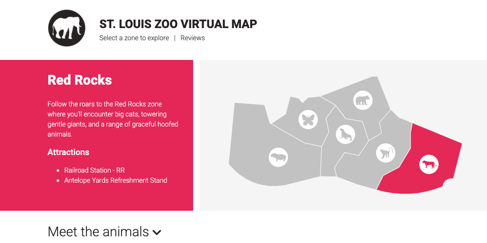
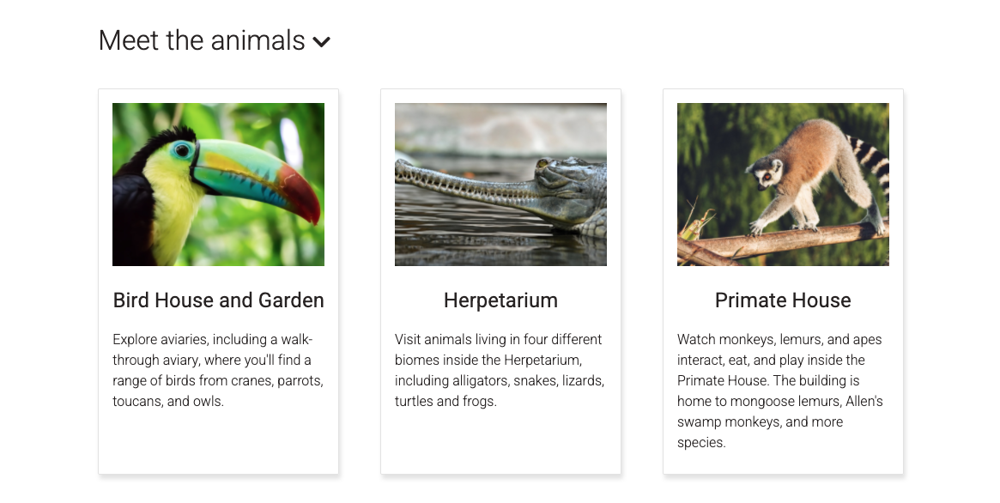
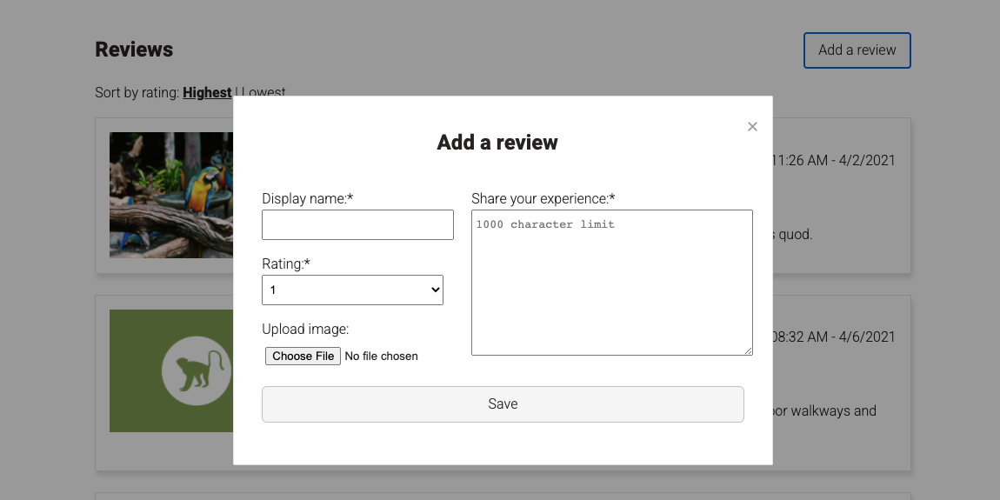

# Virtual Zoo Map

## Description
This repo serves as the frontend for a simple interactive map based on the St. Louis Zoo. Site visitors can click on map zones to view information about that zone's exhibits and attractions. 

[Backend Repo](https://github.com/staceymck/stl-zoo-map-backend)

Users can click on sections within an svg map to bring up info about zoo zones.
 

 

As they navigate through the zones, users can explore information cards about each zone's exhibits. Each card can be clicked to reveal a fact about the exhibit and/or the species that live in it.
 

Users can also add reviews/comments that include a rating and the option to upload an image.
 

## Technology
This app uses a Rails API backend with HTML, CSS and object-oriented JavaScript on the frontend. Images are stored with [Cloudinary](https://cloudinary.com/) and attached to database records via [Active Storage](https://edgeguides.rubyonrails.org/active_storage_overview.html).

## Data & Asset Sources
Zoo data is based on information available on the [St. Louis Zoo website](https://www.stlzoo.org/).

The map SVG was developed using data made available through [© OpenStreetMap contributors](https://www.openstreetmap.org/copyright).

Photos are public domain images from [Unsplash](https://unsplash.com/) and [Pexels](https://www.pexels.com/).

## License
As the included map uses data provided via OpenStreetMap, any use or adaption of the map SVG must comply with the [Creative Commons Attribution-ShareAlike 2.0 license](https://creativecommons.org/licenses/by-sa/2.0/) (CC BY-SA 2.0).